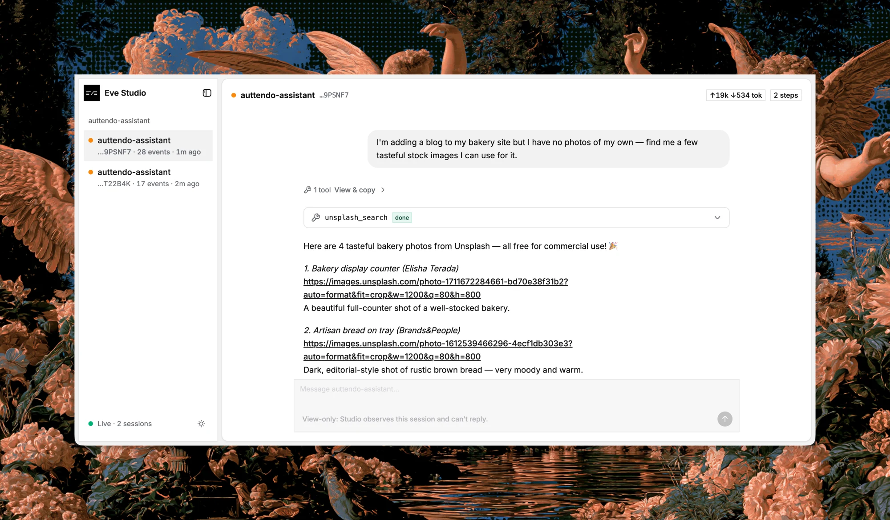

# eve-studio



eve-studio is a visual observability workspace for
[eve](https://eve.dev) agents. Mount one extension, run the Studio collector,
and inspect live sessions, messages, steps, tool calls, status, and usage from a
browser UI served next to your agent.

## Sessions are the debugging interface

A typical eve agent already keeps its behavior in files:

```txt
my-agent/
└── agent/
    ├── agent.ts            # Optional: model and runtime config
    ├── instructions.md     # Required: the always-on system prompt
    ├── tools/              # Optional: typed functions the model can call
    ├── skills/             # Optional: procedures loaded on demand
    └── extensions/
        └── studio.ts       # Mounts the Studio capture extension
```

eve-studio adds a local observer beside that project. The extension forwards
session events to the collector; the collector reduces them into a live session
registry; the UI lets you move through each run without reading raw event files.

Read the [eve documentation](https://eve.dev) for the agent project model.

## Requirements

- Node.js 24 or newer
- An eve project using a stable version in `>=0.22.3 <0.23.0`

This repository uses pnpm 10.33.4 for development. You do not need pnpm to run
`npx eve-studio`.

## Quick start

```sh
npx eve-studio
```

Run this from an eve agent project. The CLI resolves the project, checks the
installed `eve` version, offers to mount `@eve-studio/extension`, then starts
the collector and browser UI on `http://127.0.0.1:43110`.

To point Studio at a specific project:

```sh
npx eve-studio --project ./path/to/my-agent
```

To include sessions already written to `.workflow-data`:

```sh
npx eve-studio --scan-disk
```

## A minimal setup

The CLI can mount the extension for you. To do it manually, install the
extension in your eve project:

```sh
pnpm add @eve-studio/extension
```

Then create `agent/extensions/studio.ts`:

```ts
export { default } from "@eve-studio/extension";
```

Start Studio:

```sh
npx eve-studio
```

Then run or message your agent. Sessions appear live in the sidebar, grouped by
project, with the full message timeline and captured tool activity available in
the detail view.

## What Studio captures

- Live session status, including working, waiting, completed, and failed states
- Messages and message parts as the agent receives and emits them
- Step completions, tool calls, tool results, and tool errors
- Token and cost usage when eve includes usage data on step events
- Project, process, agent, channel, and eve version metadata
- Historical sessions from `.workflow-data` when started with `--scan-disk`

## Local by design

The collector listens only on `127.0.0.1`. The extension posts compact event
batches over loopback, and the collector keeps its registry in memory. Studio
does not upload sessions or add remote access. Production capture is disabled
unless you explicitly set `EVE_STUDIO_ENABLED=1`.

Forwarding is best-effort and isolated from the agent turn: if Studio is not
running, the extension drops old queued events under a fixed cap instead of
blocking or failing the agent.

## Packages

This repository is a pnpm workspace:

```txt
packages/
├── studio/      # eve-studio CLI, collector server, registry, and API
├── extension/   # eve extension that forwards session events
└── ui/          # private browser UI bundled into the studio package

apps/
├── demo-agent/  # local eve agent fixture for smoke testing
└── web/         # announcement and project landing page
```

## Local development

Install dependencies:

```sh
pnpm install
```

Build the CLI, collector, and bundled UI:

```sh
pnpm build:studio
```

Run the full smoke check:

```sh
pnpm smoke:studio
```

For UI development, run the fixture collector and Vite dev server separately:

```sh
pnpm --filter eve-studio build
pnpm --filter @eve-studio/ui dev:collector
pnpm --filter @eve-studio/ui dev
```

Open `http://127.0.0.1:43120`. The UI proxies API requests to the local
collector on port `43110`.

Build the project landing page:

```sh
pnpm --filter @eve-studio/web build
```

## Contributing

Contributions are welcome. See [CONTRIBUTING.md](CONTRIBUTING.md) before opening
your first pull request. Keep changes focused, include tests for behavior that
touches capture or reduction logic, and run the relevant package checks:

```sh
pnpm lint
pnpm format:check
pnpm test
pnpm typecheck
pnpm smoke:studio
```

## Security

Please do not open public issues for security vulnerabilities. See the
[security policy](SECURITY.md) for private reporting options.

## Beta

eve-studio is early software and follows eve preview APIs. The extension
surface, event format, UI, and CLI behavior may change before a stable release.
